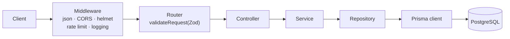

# Architecture

## Request lifecycle



1. **Middleware** (`src/server.ts`) parses the body, applies CORS, security headers and rate limiting, and logs the request.
2. The **router** matches the route and validates `params`, `query` and `body` against a Zod schema. Invalid input returns `400` before any of your code runs.
3. The **controller** passes the request data to the service and sends back whatever the service returns.
4. The **service** holds the business logic and turns every outcome, including errors, into a `ServiceResponse`.
5. The **repository** is the only code that talks to the database.

## Folders

| Path | Purpose |
| --- | --- |
| `src/index.ts` | Entry point. Starts the HTTP server and handles graceful shutdown (closes the server, then disconnects Prisma) |
| `src/server.ts` | Builds the Express `app` (middleware, routes, Swagger, error handlers). Exported without listening, so tests can drive it with Supertest |
| `src/api/<feature>/` | One folder per feature. Everything for a resource lives together |
| `src/api-docs/` | Combines every feature's OpenAPI registry into one document and serves Swagger UI at `/` and the raw spec at `/swagger.json` |
| `src/common/` | Code shared by features: Prisma client, middleware, the response envelope, config and validation helpers |
| `src/generated/prisma/` | The typed Prisma client, generated from `prisma/schema/`. Never edit it by hand |
| `prisma/` | Database schema, migrations and seed data. See [Database](database.md) |

## Feature module layers

A feature (for example `src/api/user/`) has these files:

| File | Responsibility | Rules |
| --- | --- | --- |
| `userModel.ts` | Zod schemas: the API data shape (`UserSchema`) and request validation (`GetUserSchema`) | Types come from `z.infer`. Call `extendZodWithOpenApi(z)` once in the file |
| `userRouter.ts` | Express routes plus an `OpenAPIRegistry` entry for each route | Every route is registered in OpenAPI and validated with `validateRequest(...)` |
| `userController.ts` | Converts the HTTP request into a service call and sends the response | No business logic. Always replies with `res.status(r.statusCode).send(r)` |
| `userService.ts` | Business logic | Always returns a `ServiceResponse` and never throws. Catches errors, logs them, and returns `ServiceResponse.failure(...)` |
| `userRepository.ts` | Database access through the shared `prisma` client | The **only** layer that imports `prisma` |
| `__tests__/` | Router tests (real database) and service tests (mocked repository) | See [Testing](testing.md) |

Services receive their repository through the constructor (`new UserService(repository)`), and a singleton instance is exported (`userService`) for the controller to use. This keeps services easy to unit-test.

A new feature is wired into the app in **two places**. See [Adding a feature](adding-a-feature.md).

## Response envelope

Every JSON response has the same shape, built with `ServiceResponse` (`src/common/models/serviceResponse.ts`):

```json
{ "success": true, "message": "User found", "data": { "id": 1, "name": "Alice" }, "statusCode": 200 }
```

- Use `ServiceResponse.success(message, data, statusCode?)` or `ServiceResponse.failure(message, data, statusCode?)`. The constructor is private.
- `statusCode` defaults to `200` for success and `400` for failure. Pass a specific code from `StatusCodes` otherwise.
- `ServiceResponseSchema(schema)` is the matching Zod wrapper, used by `createApiResponse()` to document responses in Swagger.

## Validation and API docs

Zod schemas do three jobs from one definition: the TypeScript types, runtime request validation, and the OpenAPI (Swagger) documentation.

- `validateRequest(schema)` checks `{ params, query, body }` and returns a `400` with messages like `Invalid input: params.id: ID must be a numeric value`.
- It only validates. It does **not** replace `req.params` or `req.body` with the parsed values, so controllers still convert types themselves (for example `Number.parseInt(req.params.id, 10)`).
- Shared validators live in `src/common/utils/commonValidation.ts`. `commonValidations.id` accepts positive whole numbers up to PostgreSQL's `integer` limit.

## Middleware order

`express.json` → `urlencoded` → CORS → helmet → rate limiter → request logger → **feature routes** → Swagger (`/`, `/swagger.json`) → 404 handler → error logger.

Swagger UI is mounted at `/`, so feature routes must be mounted **before** it.

## Configuration

`src/common/utils/envConfig.ts` reads `.env` and validates every variable with Zod **when the app starts**. If a value is missing or invalid, the app refuses to start and prints which one.

| Variable | Default | Notes |
| --- | --- | --- |
| `NODE_ENV` | `production` | `development`, `production` or `test` |
| `HOST` / `PORT` | `localhost` / `8080` | `HOST` is only used in the startup log message |
| `CORS_ORIGIN` | `http://localhost:8080` | Allowed browser origin |
| `COMMON_RATE_LIMIT_MAX_REQUESTS` | `1000` | Requests allowed per window, per IP |
| `COMMON_RATE_LIMIT_WINDOW_MS` | `1000` | Multiplied by `15 * 60` in `rateLimiter.ts`, so `1000` means a **15-minute** window |
| `DATABASE_URL` | none (required) | Must be a `postgres://` or `postgresql://` URL |

Read config through the exported `env` object (`env.PORT`, `env.isProduction`), not `process.env`. To add a variable, add it to the schema in `envConfig.ts` **and** to `.env.template`.

## Logging

- Use the pino `logger` exported from `@/server` in application code, not `console.log`.
- Every request is logged by `pino-http` with a request ID. The ID comes from the `X-Request-Id` header, or is generated and returned in that header.
- Log level depends on the response status: `5xx` → error, `4xx` → warn, otherwise info.
- Outside production, logs are pretty-printed at debug level.

## Health check

`GET /health-check` runs `SELECT 1` against the database. It returns `200` when the database answers and `503` (`Database is unreachable`) when it doesn't, which makes it suitable for load balancer and container health probes.
